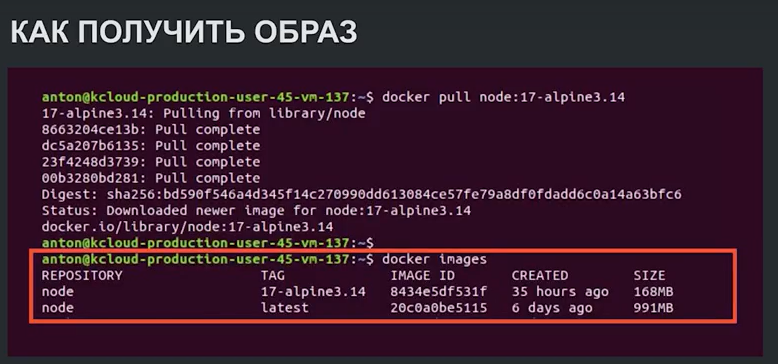
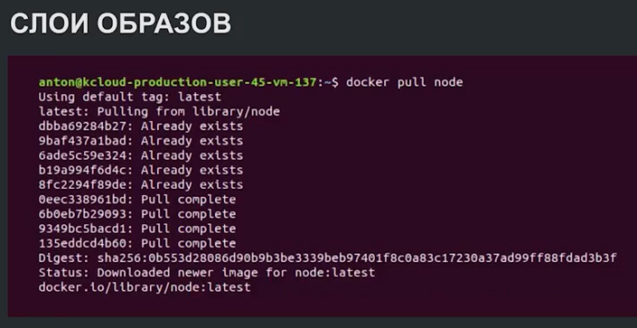
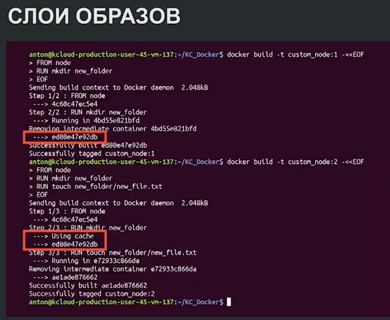
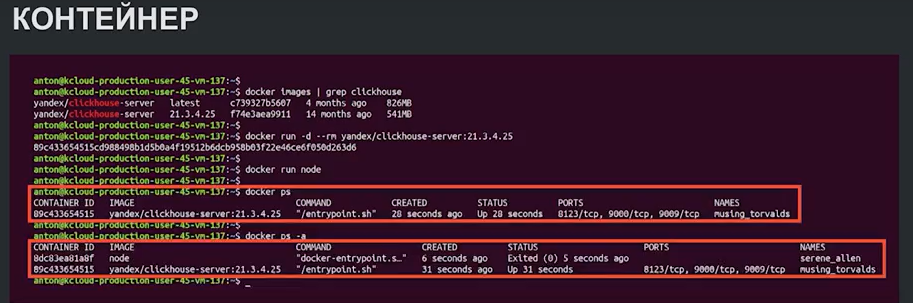
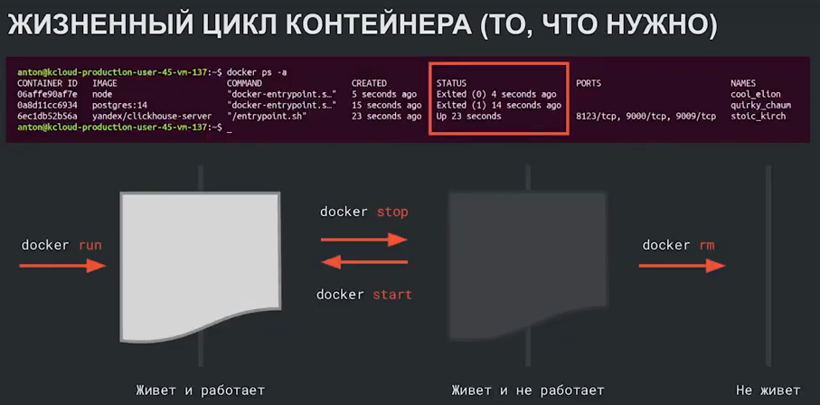
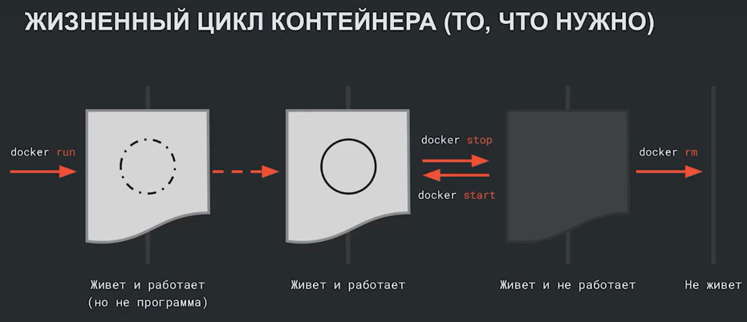
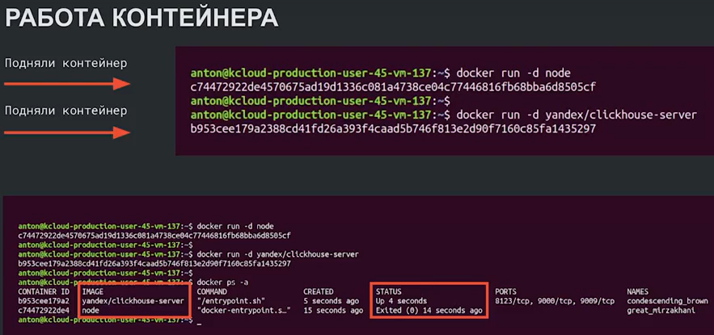

Оновные команды по докеру здесь: https://docs.docker.com/reference/cli/docker/container/run/

# Лекция2. Образы и контейнеры

Как получить образ?

1) Команда  **docker pull <образ>** - скчать из репозитория
2) На основе готового образа создать свой через Dockerfile
3) Команда **docker commit <контейнер>** - создать образ на основе контейнера

Что есть у образа?
1) Название(REPOSITORY): node, ubuntu etc.
2) Версия(TAG): latest(по умолчанию скачивается последняя версия), alpine(только самое нужное,  обычно весит в 2 раза меньше) и др.
3) ID: уникальный номер, по которому можно скачать образ
4) CREATED
5) SIZE (занимают много места!!)



Образы занимают много места, но для экономии докер может переиспользовать слои.

Здесь, например, при скачивании образа докер говорит, что такие слои у него уже есть.



В примере мы пытаемся создать два образа, отличающиеся только одним файлом. Тогда докер использует кэнш, а не пересоздает слой заново.



## Контейнер

Что есть у контейнера?
1) CONTAINER ID   
2) IMAGE: образ на основе, которого подняли контейнер     
3) COMMAND   
4) CREATED: время запуска   
5) STATUS: статус Up - поднят, Exit - не поднят   
6) PORTS
7) NAMES: Если явно не присваивается, то имя присвоивается рандомно



Жизненный цикл контейнера

Мы подняли контейнер **docker run**, далее программа живет и работает. Мы сами можем остановить эту программу **docker stop** и возобновить рвботу. Либо программа может сделать все дела, либо упасть с ошибкой --> контейнер остановился, но живет (а программа в нем нет). Удалить контейнер полностью **docker rm**.



Может быть такое, что контейнер поднялся, а программа в нем ещё не работает. Такое может случиться, например, с базой данных. База внутри контейнера ещё не развернулась, а мы делаем в неё запрос, поэтому может быть ошибка.



Контейнер работает пока внем работает программа. Конейнер будет в статусе Exit, если программа в нем отработала. Как показано в примере c node, который сразу же отработал.



## Команды

```sh
#Команды для образов

#скчать образ (имя можно найти в репозитории)
docker pull <например, node>
docker pull <например, node:16> # последнюю версию
#посмотреть список образов
docker images
docker image ls
#удалить образ
docker rmi <например, node:alphaine>

#Команды для контейнеров

#запустить контейнеру и присовоить при создании имя контейнеру
docker run <Образ> #по умолчанию имя рандомное
docker run --name <имя_контейнера> <образ> 
docker run -it <образ> # войти в контейнер
#вывести список всех контейнеров
docker ps #вывести только работающие контейнеры
docker ps -a
#вывести только айдишники контейнеров
docker ps -q
#Остановить контейнер
docker stop <имя_контейнера>
#Возбновить после остановки работу
docker start <имя_контейнера>
#Удалить контейнер после завершения его работы
docker run --rm <имя_контейнера>
#Зайти в контейнер во время его работы
docker exec -it <имя_контейнера> <программа, которую нужно запустить>
#Удалить контейнер
docker rm <имя_контейнера>
```
**Частые приемы при работе с контейнерами**

Как запускать контейнеры в фоновом режиме?
```sh
docker run -d yandex/clickhouse-server #выводится ID контейнера и он уходит в фоновый режим
```
Чтобы постоянно не удалять контейнер, используется опция --rm, Которая удаляет контейнер сразу после его остановки.

```sh
docker run --rm yandex/clickhouse-server
```
Как удалить или остановить несколько контейнеров через ID?
```sh
docker stop $(docker ps -q)
```

Таким образом, типичный запуск контейнера
```
docker run -it --rm <имя_контейнера> <образ>
```

Чтобы слепить новый образ на оснвое уже имеющегося контейнера, необходимо сделать следующее:
```sh
docker commit <имя_контейнера> <имя_нового_образа>
```